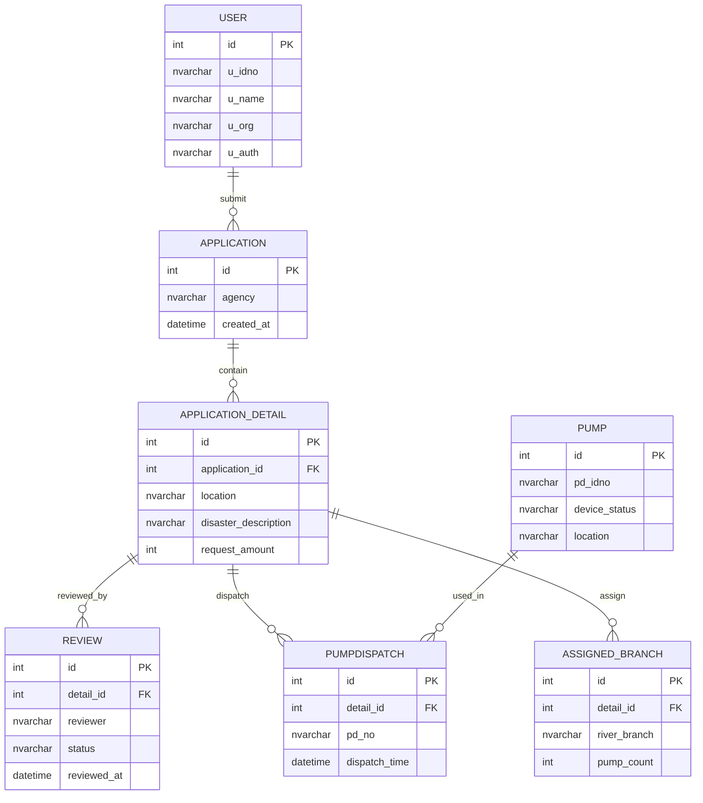

# ER Diagram

下圖為系統主要資料表與關聯（Mermaid erDiagram）：



對應資料表的 SQL DDL 範本：

```sql
CREATE TABLE USER (
    id INT PRIMARY KEY,
    u_idno NVARCHAR(255),
    u_name NVARCHAR(255),
    u_org NVARCHAR(255),
    u_auth NVARCHAR(255)
);

CREATE TABLE APPLICATION (
    id INT PRIMARY KEY,
    agency NVARCHAR(255),
    created_at DATETIME
);

CREATE TABLE APPLICATION_DETAIL (
    id INT PRIMARY KEY,
    application_id INT,
    location NVARCHAR(255),
    disaster_description NVARCHAR(255),
    request_amount INT,
    FOREIGN KEY (application_id) REFERENCES APPLICATION(id)
);

CREATE TABLE REVIEW (
    id INT PRIMARY KEY,
    detail_id INT,
    reviewer NVARCHAR(255),
    status NVARCHAR(255),
    reviewed_at DATETIME,
    FOREIGN KEY (detail_id) REFERENCES APPLICATION_DETAIL(id)
);

CREATE TABLE PUMPDISPATCH (
    id INT PRIMARY KEY,
    detail_id INT,
    pd_no NVARCHAR(255),
    dispatch_time DATETIME,
    FOREIGN KEY (detail_id) REFERENCES APPLICATION_DETAIL(id),
    FOREIGN KEY (pd_no) REFERENCES PUMP(pd_idno)
);

CREATE TABLE ASSIGNED_BRANCH (
    id INT PRIMARY KEY,
    detail_id INT,
    river_branch NVARCHAR(255),
    pump_count INT,
    FOREIGN KEY (detail_id) REFERENCES APPLICATION_DETAIL(id)
);

CREATE TABLE PUMP (
    id INT PRIMARY KEY,
    pd_idno NVARCHAR(255),
    device_status NVARCHAR(255),
    location NVARCHAR(255)
);
```
